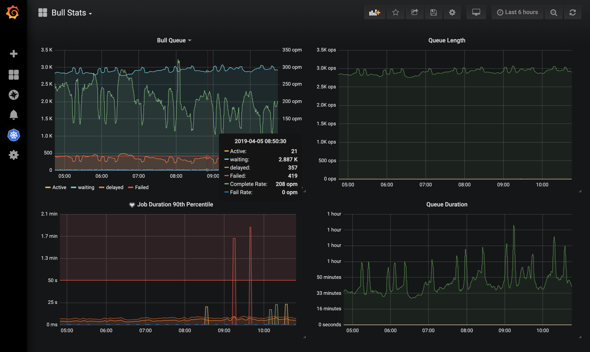

# Bull Queue Exporter
**Prometheus exporter for Bull metrics.**

<p align="right">
  <a href="https://travis-ci.org/UpHabit/bull_exporter/branches/">
    
  </a>
  <br/>
</p>
<p align="center">
  <a href="https://prometheus.io/">
    
  </a>
  <a href="https://github.com/OptimalBits/bull">
    
  </a>
</p>

___


## UI


## Setup
#### Prometheus
**An existing prometheus server is required to use this project**

To learn more about how to setup promethues and grafana see: https://eksworkshop.com/monitoring/

#### Grafana
The dashboard pictured above is [available to download from grafana](https://grafana.com/grafana/dashboards/10128).
It will work aslong as EXPORTER_STAT_PREFIX is not changed.

## Queue Discovery
Queues are discovered at start up by running `KEYS bull:*:id` 
this can also be triggered manually from the `/discover_queues` endpoint
`curl -XPOST localhost:9538/discover_queues`

## Metrics

| Metric                       | type    | description |
|------------------------------|---------|-------------|
| bull_queue_completed         | counter | Total number of completed jobs                          |
| bull_queue_complete_duration | summary | Processing time for completed jobs                      |
| bull_queue_active            | counter | Total number of active jobs (currently being processed) |
| bull_queue_delayed           | counter | Total number of jobs that will run in the future        |
| bull_queue_failed            | counter | Total number of failed jobs                             |
| bull_queue_waiting           | counter | Total number of jobs waiting to be processed            |

## Kubernetes Usage

### Environment variables for default docker image

| variable              | default                  | description                                     |
|-----------------------|--------------------------|-------------------------------------------------|
| EXPORTER_REDIS_URL    | redis://localhost:6379/0 | Redis uri to connect                            |
| EXPORTER_PREFIX       | bull                     | prefix for queues                               |
| EXPORTER_STAT_PREFIX  | bull_queue_              | prefix for exported metrics                     |
| EXPORTER_QUEUES       | -                        | a space separated list of queues to check       |
| EXPORTER_AUTODISCOVER | -                        | set to '0' or 'false' to disable queue discovery|


### Example deployment

see: [k8s-sample.yaml](./docs/k8s-sample.yaml) for more options

```yaml
apiVersion: apps/v1

kind: Deployment
metadata:
  name: bull-exporter
  labels:
    app: bull
    role: exporter

spec:
  selector:
    matchLabels:
      app: bull
      role: exporter
  replicas: 1
  template:
    metadata:
      labels:
        app: bull
        role: exporter
    spec:
      containers:
        - name: bull-exporter
          image: uphabit/bull_exporter:latest
          securityContext:
            runAsGroup: 65534 # nobody
            runAsUser: 65534 # nobody
            runAsNonRoot: true
            privileged: false
            allowPrivilegeEscalation: false
            readOnlyRootFilesystem: true
            capabilities:
              drop:
                - all
          resources:
            requests:
              cpu: 100m
              memory: 128M
            limits:
              cpu: 200m
              memory: 512M
          env:
              # space delimited list of queues
            - name: EXPORTER_QUEUES
              value: "mail job_one video audio"

              # find the redis service in the cluster
            - name: EXPORTER_REDIS_URL
              value: redis://redis:6379/0
---
apiVersion: v1
kind: Service
metadata:
  name: bull-exporter
  labels:
    app: bull
    role: exporter
  annotations:
    prometheus.io/scrape: 'true'
    prometheus.io/port: '9538'
spec:
  type: ClusterIP
  ports:
    - name: http
      port: 9538
      targetPort: 9538
  selector:
    app: bull
    role: exporter

```
